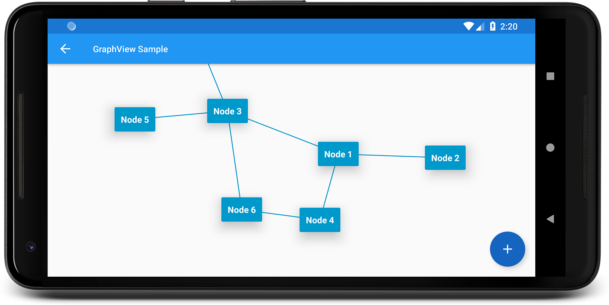

GraphView
===========

Android GraphView is used to display data in graph structures.

Overview
========
The library is designed to support different algorithms. Currently, only the algorithms from Walker (with the runtime improvements from Buchheim) and Fruchterman&Reingold (for small graphs) have been implemented.

Download
========

```groovy
dependencies {
    implementation 'de.blox:graphview:0.4.0'
}
```
Usage
======

```xml
<LinearLayout
    android:layout_width="match_parent"
    android:layout_height="match_parent">
    <de.blox.graphview.GraphView
     android:id="@+id/graph"
     android:layout_width="match_parent"
     android:layout_height="match_parent">
    </de.blox.graphview.GraphView>
</LinearLayout>
```
You can make the node Layout how you like. Just define a layout file, e.g. ```node.xml``` ...
```xml
<android.support.v7.widget.CardView xmlns:android="http://schemas.android.com/apk/res/android"
                                    xmlns:card_view="http://schemas.android.com/apk/res-auto"
                                    android:id="@+id/card_view"
                                    android:layout_width="match_parent"
                                    android:layout_height="wrap_content"
                                    android:layout_gravity="center"
                                    android:layout_margin="5dp"
                                    card_view:cardBackgroundColor="@android:color/holo_blue_dark"
                                    card_view:cardElevation="16dp"
                                    card_view:contentPadding="10dp">

    <LinearLayout
        android:layout_width="match_parent"
        android:layout_height="match_parent"
        android:orientation="vertical">

        <TextView
            android:id="@+id/textView"
            android:layout_width="wrap_content"
            android:layout_height="wrap_content"
            android:textColor="@android:color/white"
            android:textStyle="bold"/>

    </LinearLayout>
</android.support.v7.widget.CardView>
```

... and use it with the adapter

```java
public class MainActivity extends AppCompatActivity {
    private int nodeCount = 1;

    @Override
    protected void onCreate(Bundle savedInstanceState) {
        super.onCreate(savedInstanceState);
        setContentView(R.layout.activity_main);
        GraphView graphView = findViewById(R.id.graph);

        final BaseGraphAdapter<ViewHolder> adapter = new BaseGraphAdapter<ViewHolder>(this, R.layout.node, graph) {
            @NonNull
            @Override
            public ViewHolder onCreateViewHolder(View view) {
                return new ViewHolder(view);
            }

            @Override
            public void onBindViewHolder(ViewHolder viewHolder, Object data, int position) {
                viewHolder.mTextView.setText(data.toString());
            }
        };
        graphView.setAdapter(adapter);
        
        // example tree
        final Graph graph = new Graph();
        final Node node1 = new Node(getNodeText());
        final Node node2 = new Node(getNodeText());
        final Node node3 = new Node(getNodeText());
        final Node node4 = new Node(getNodeText());
        final Node node5 = new Node(getNodeText());
        final Node node6 = new Node(getNodeText());
        final Node node8 = new Node(getNodeText());
        final Node node7 = new Node(getNodeText());
        final Node node9 = new Node(getNodeText());
        final Node node10 = new Node(getNodeText());
        final Node node11 = new Node(getNodeText());
        final Node node12 = new Node(getNodeText());

        graph.addEdge(node1, node2);
        graph.addEdge(node1, node3);
        graph.addEdge(node1, node4);
        graph.addEdge(node2, node5);
        graph.addEdge(node2, node6);
        graph.addEdge(node6, node7);
        graph.addEdge(node6, node8);
        graph.addEdge(node4, node9);
        graph.addEdge(node4, node10);
        graph.addEdge(node4, node11);
        graph.addEdge(node11, node12);

        // set the algorithm here 
        final BuchheimWalkerConfiguration configuration = new BuchheimWalkerConfiguration.Builder()
                .setSiblingSeparation(100)
                .setLevelSeparation(300)
                .setSubtreeSeparation(300)
                .setOrientation(BuchheimWalkerConfiguration.ORIENTATION_TOP_BOTTOM)
                .build();
        adapter.setAlgorithm(new BuchheimWalkerAlgorithm(configuration));
        adapter.setGraph(graph);
    }
    
    private String getNodeText() {
        return "Node " + nodeCount++;
    }
}
```

ViewHolder class:
```java
    private class ViewHolder {
        TextView mTextView;
        ViewHolder(View view) {
            mTextView = view.findViewById(R.id.textView);
        }
    }
```

Customization
=============

To use the custom attributes you have to add the namespace first: ```
    xmlns:app="http://schemas.android.com/apk/res-auto"```

| Attribute        | Format    | Example                        | Explanation|
|------------------|-----------|--------------------------------|------------|
| lineThickness   | Dimension | 10dp                           | Set how thick the connection lines should be
| lineColor       | Color     | "@android:color/holo_red_dark" | Set the color of the connection lines
| useMaxSize      | Boolean   | true                           | Use the same size for each node

Each of the attributes has a corresponding setter in the GraphView class, if you want to use it programmatically.

GraphView internally uses [ZoomLayout](https://github.com/natario1/ZoomLayout)  for its zoom feature. To change the zoom values just use the different attributes described in the ZoomLayout project site.

Examples
========
#### Rooted Tree


#### Directed Graph


License
=======

    Copyright 2018 Team-Blox

    Licensed under the Apache License, Version 2.0 (the "License");
    you may not use this file except in compliance with the License.
    You may obtain a copy of the License at

       http://www.apache.org/licenses/LICENSE-2.0

    Unless required by applicable law or agreed to in writing, software
    distributed under the License is distributed on an "AS IS" BASIS,
    WITHOUT WARRANTIES OR CONDITIONS OF ANY KIND, either express or implied.
    See the License for the specific language governing permissions and
    limitations under the License.