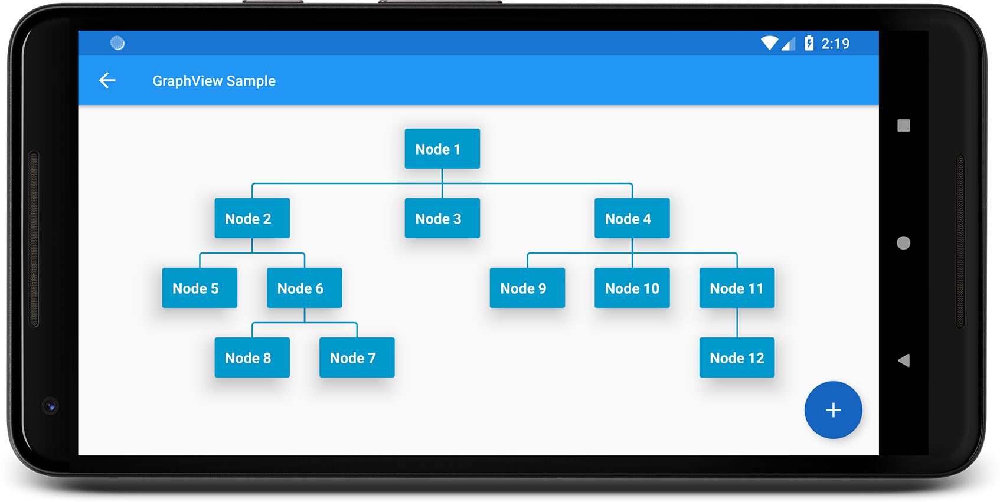
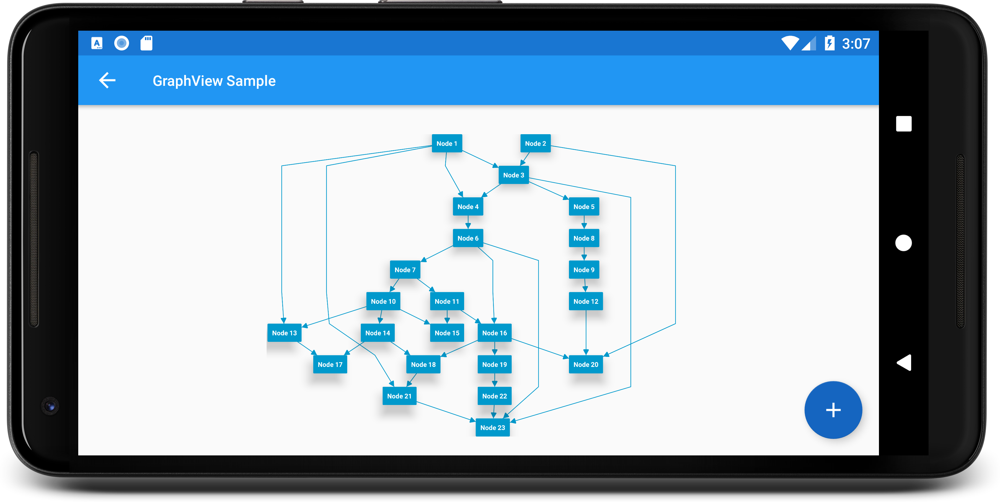

GraphView
===========

Android GraphView is used to display data in graph structures.


Overview
========
The library can be used within `RecyclerView` and currently works with small graphs only.

**This project is currently experimental and the API subject to breaking changes without notice.**

Download
========
The library is only available on MavenCentral. Please add this code to your build.gradle file on project level:
```gradle
allprojects {
  repositories {
    ...
    mavenCentral()
  }
}
```

And add the dependency to the build.gradle file within the app module:
```gradle
dependencies {
    implementation 'dev.bandb.graphview:graphview:0.8.1'
}
```
Layouts
======
### Tree
Uses Walker's algorithm with Buchheim's runtime improvements (`BuchheimWalkerLayoutManager` class). Currently only the `TreeEdgeDecoration` can be used to draw the edges. Supports different orientations. All you have to do is using the `BuchheimWalkerConfiguration.Builder.setOrientation(int)` with either `ORIENTATION_LEFT_RIGHT`, `ORIENTATION_RIGHT_LEFT`, `ORIENTATION_TOP_BOTTOM` and
`ORIENTATION_BOTTOM_TOP` (default). Furthermore parameters like sibling-, level-, subtree separation can be set.
### Directed graph
Directed graph drawing by simulating attraction/repulsion forces. For this the algorithm by Fruchterman and Reingold (`FruchtermanReingoldLayoutManager` class) was implemented. To draw the edges you can use `ArrowEdgeDecoration` or `StraightEdgeDecoration`.
### Layered graph
Algorithm from Sugiyama et al. for drawing multilayer graphs, taking advantage of the hierarchical structure of the graph (`SugiyamaLayoutManager` class). Currently only the `SugiyamaArrowEdgeDecoration` can be used to draw the edges. You can also set the parameters for node and level separation using the `SugiyamaConfiguration.Builder`.

Usage
======
GraphView must be integrated with `RecyclerView`.
For this you’ll need to add a `RecyclerView` to your layout and create an item layout like usually when working with `RecyclerView`.

```xml
<com.otaliastudios.zoom.ZoomLayout
    android:layout_width="match_parent"
    android:layout_height="match_parent"
    app:hasClickableChildren="true">

    <androidx.recyclerview.widget.RecyclerView
        android:id="@+id/recycler"
        android:layout_width="wrap_content"
        android:layout_height="wrap_content" />

</com.otaliastudios.zoom.ZoomLayout>
```

Currently GraphView must be used together with a Zoom Engine like [ZoomLayout](https://github.com/natario1/ZoomLayout). To change the zoom values just use the different attributes described in the ZoomLayout project site.

To create a graph, we need to instantiate the `Graph` class. Next submit your graph to your Adapter, for that you must extend from the `AbstractGraphAdapter` class.

```kotlin
private void setupGraphView {
    val recycler = findViewById(R.id.recycler)

    // 1. Set a layout manager of the ones described above that the RecyclerView will use.
    val configuration = BuchheimWalkerConfiguration.Builder()
                    .setSiblingSeparation(100)
                    .setLevelSeparation(100)
                    .setSubtreeSeparation(100)
                    .setOrientation(BuchheimWalkerConfiguration.ORIENTATION_TOP_BOTTOM)
                    .build()
    recycler.layoutManager = BuchheimWalkerLayoutManager(context, configuration)

    // 2. Attach item decorations to draw edges
    recycler.addItemDecoration(TreeEdgeDecoration())

    // 3. Build your graph
    val graph = Graph()
    val node1 = Node("Parent")
    val node2 = Node("Child 1")
    val node3 = Node("Child 2")

    graph.addEdge(node1, node2)
    graph.addEdge(node1, node3)

    // 4. You will need a simple Adapter/ViewHolder.
    // 4.1 Your Adapter class should extend from `AbstractGraphAdapter`
    adapter = object : AbstractGraphAdapter<NodeViewHolder>() {

        // 4.2 ViewHolder should extend from `RecyclerView.ViewHolder`
        override fun onCreateViewHolder(parent: ViewGroup, viewType: Int): NodeViewHolder {
            val view = LayoutInflater.from(parent.context)
                    .inflate(R.layout.node, parent, false)
            return NodeViewHolder(view)
        }

        override fun onBindViewHolder(holder: NodeViewHolder, position: Int) {
            holder.textView.text = getNodeData(position).toString()
        }
    }.apply {
        // 4.3 Submit the graph
        this.submitGraph(graph)
        recycler.adapter = this
    }
}
```

Customization
======
You can change the edge design by supplying your custom paint object to your edge decorator.
```kotlin
    val edgeStyle = Paint(Paint.ANTI_ALIAS_FLAG).apply {
        strokeWidth = 5f
        color = Color.BLACK
        style = Paint.Style.STROKE
        strokeJoin = Paint.Join.ROUND
        pathEffect = CornerPathEffect(10f) 
    }
    
    recyclerView.addItemDecoration(TreeEdgeDecoration(edgeStyle))
```

If you want that your nodes are all the same size you can set `useMaxSize` to `true`. The biggest node defines the size for all the other nodes.
```kotlin
    recyclerView.layoutManager = BuchheimWalkerLayoutManager(this, configuration).apply { 
        useMaxSize = true
    }
```

Examples
========
#### Rooted Tree


#### Directed Graph


#### Layered Graph


License
=======

    Copyright 2019 - 2021 Block & Block

    Licensed under the Apache License, Version 2.0 (the "License");
    you may not use this file except in compliance with the License.
    You may obtain a copy of the License at

       http://www.apache.org/licenses/LICENSE-2.0

    Unless required by applicable law or agreed to in writing, software
    distributed under the License is distributed on an "AS IS" BASIS,
    WITHOUT WARRANTIES OR CONDITIONS OF ANY KIND, either express or implied.
    See the License for the specific language governing permissions and
    limitations under the License.