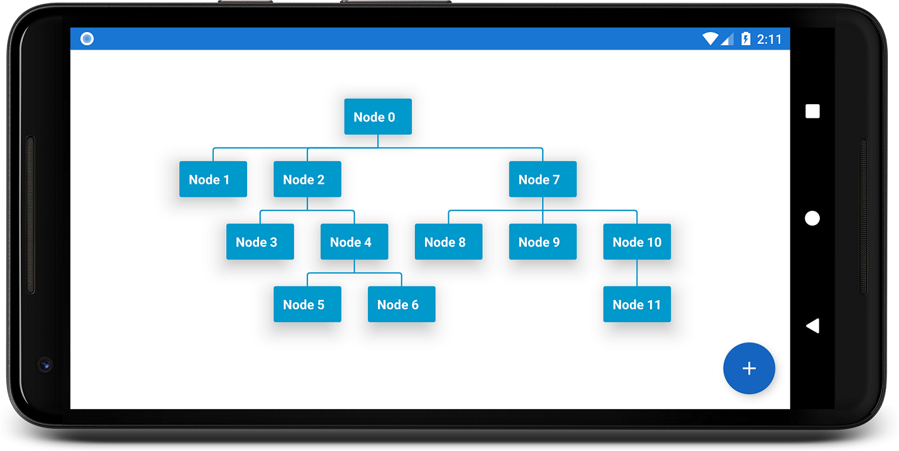

TreeView
===========

Android TreeView is used to display data in tree structures.



Overview
========
The library is designed to support different algorithms. Currently, only the algorithm from Walker (with the runtime improvements from Buchheim) has been implemented. Feel free to contribute. The algorithm should only implement the `Algorithm` Interface.

Download
========

```groovy
dependencies {
    implementation 'de.blox.treeview:treeview:0.1.0'
}
```

Usage
======

```xml
<LinearLayout
    android:layout_width="match_parent"
    android:layout_height="match_parent">
    <de.blox.treeview.TreeView
     android:id="@+id/treeview"
     android:layout_width="match_parent"
     android:layout_height="match_parent">
    </de.blox.treeview.TreeView>
</LinearLayout>
```
You can make the node Layout how you like. Just define a layout file, e.g. ```node.xml``` ...
```xml
<android.support.v7.widget.CardView xmlns:android="http://schemas.android.com/apk/res/android"
                                    xmlns:card_view="http://schemas.android.com/apk/res-auto"
                                    android:id="@+id/card_view"
                                    android:layout_width="match_parent"
                                    android:layout_height="wrap_content"
                                    android:layout_gravity="center"
                                    android:layout_margin="5dp"
                                    card_view:cardBackgroundColor="@android:color/holo_blue_dark"
                                    card_view:cardElevation="16dp"
                                    card_view:contentPadding="10dp">

    <LinearLayout
        android:layout_width="match_parent"
        android:layout_height="match_parent"
        android:orientation="vertical">

        <TextView
            android:id="@+id/textView"
            android:layout_width="wrap_content"
            android:layout_height="wrap_content"
            android:textColor="@android:color/white"
            android:textStyle="bold"/>

    </LinearLayout>
</android.support.v7.widget.CardView>
```

... and use it with the adapter

```java
public class MainActivity extends AppCompatActivity {
    private int nodeCount = 0;

    @Override
    protected void onCreate(Bundle savedInstanceState) {
        super.onCreate(savedInstanceState);
        setContentView(R.layout.activity_main);
        TreeView treeView = findViewById(R.id.tree);

        BaseTreeAdapter adapter = new BaseTreeAdapter<ViewHolder>(this, R.layout.node) {
            @NonNull
            @Override
            public ViewHolder onCreateViewHolder(View view) {
                return new ViewHolder(view);
            }

            @Override
            public void onBindViewHolder(ViewHolder viewHolder, Object data, int position) {
                viewHolder.mTextView.setText(data.toString());
            }
        };
        treeView.setAdapter(adapter);
        
        // example tree
        TreeNode rootNode = new TreeNode(getNodeText());
        rootNode.addChild(new TreeNode(getNodeText()));
        final TreeNode child3 = new TreeNode(getNodeText());
        child3.addChild(new TreeNode(getNodeText()));
        final TreeNode child6 = new TreeNode(getNodeText());
        child6.addChild(new TreeNode(getNodeText()));
        child6.addChild(new TreeNode(getNodeText()));
        child3.addChild(child6);
        rootNode.addChild(child3);
        final TreeNode child4 = new TreeNode(getNodeText());
        child4.addChild(new TreeNode(getNodeText()));
        child4.addChild(new TreeNode(getNodeText()));
        rootNode.addChild(child4);

        adapter.setRootNode(rootNode);
    }
    
    private String getNodeText() {
        return "Node " + nodeCount++;
    }
}
```

ViewHolder class:
```java
    private class ViewHolder {
        TextView mTextView;
        ViewHolder(View view) {
            mTextView = view.findViewById(R.id.textView);
        }
    }
```

Customization
=============

To use the custom attributes you have to add the namespace first: ```
    xmlns:app="http://schemas.android.com/apk/res-auto"```

| Attribute        | Format    | Example                        | Explanation|
|------------------|-----------|--------------------------------|------------|
| levelSeparation | Dimension | 50dp                           | How much space should be used between levels
| lineThickness   | Dimension | 10dp                           | Set how thick the connection lines should be
| lineColor       | Color     | "@android:color/holo_red_dark" | Set the color of the connection lines
| useMaxSize      | Boolean   | true                           | Use the same size for each node

License
=======

    Copyright 2018 Team-Blox

    Licensed under the Apache License, Version 2.0 (the "License");
    you may not use this file except in compliance with the License.
    You may obtain a copy of the License at

       http://www.apache.org/licenses/LICENSE-2.0

    Unless required by applicable law or agreed to in writing, software
    distributed under the License is distributed on an "AS IS" BASIS,
    WITHOUT WARRANTIES OR CONDITIONS OF ANY KIND, either express or implied.
    See the License for the specific language governing permissions and
    limitations under the License.